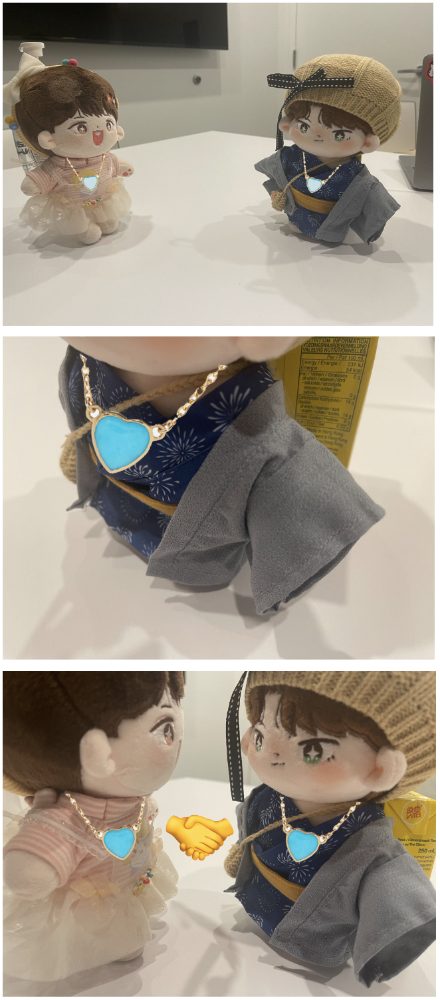
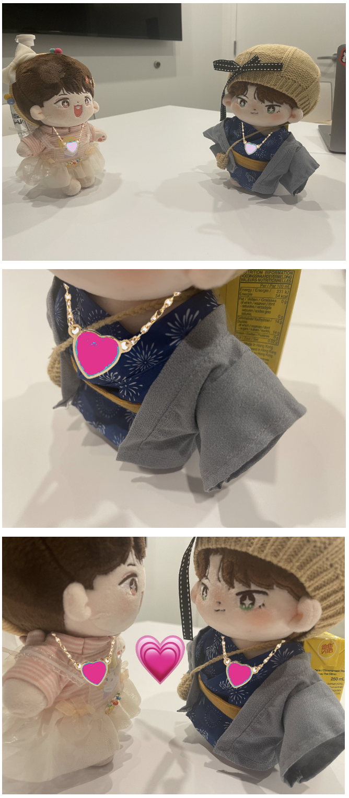
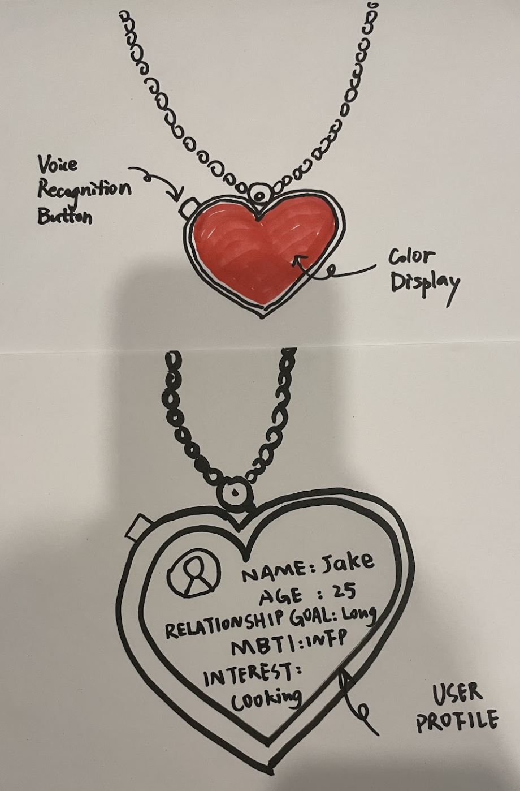

# Staging Interaction

\*\***NAME OF COLLABORATORS HERE**\*\*

In the original stage production of Peter Pan, Tinker Bell was represented by a darting light created by a small handheld mirror off-stage, reflecting a little circle of light from a powerful lamp. Tinkerbell communicates her presence through this light to the other characters. See more info [here](https://en.wikipedia.org/wiki/Tinker_Bell). 

There is no actor that plays Tinkerbell--her existence in the play comes from the interactions that the other characters have with her.

For lab this week, we draw on this and other inspirations from theatre to stage interactions with a device where the main mode of display/output for the interactive device you are designing is lighting. You will plot the interaction with a storyboard, and use your computer and a smartphone to experiment with what the interactions will look and feel like. 

_Make sure you read all the instructions and understand the whole of the laboratory activity before starting!_

## Prep

### To start the semester, you will need:
1. Read about Git [here](https://git-scm.com/book/en/v2/Getting-Started-What-is-Git%3F).
2. Set up your own Github "Lab Hub" repository to keep all you work in record by [following these instructions](https://github.com/FAR-Lab/Developing-and-Designing-Interactive-Devices/blob/2021Fall/readings/Submitting%20Labs.md).
3. Set up the README.md for your Hub repository (for instance, so that it has your name and points to your own Lab 1) and [learn how to](https://guides.github.com/features/mastering-markdown/) organize and post links to your submissions on your README.md so we can find them easily.

### For this lab, you will need:
1. Paper
2. Markers/ Pens
3. Scissors
4. Smart Phone -- The main required feature is that the phone needs to have a browser and display a webpage.
5. Computer -- We will use your computer to host a webpage which also features controls.
6. Found objects and materials -- You will have to costume your phone so that it looks like some other devices. These materials can include doll clothes, a paper lantern, a bottle, human clothes, a pillow case, etc. Be creative!

### Deliverables for this lab are: 
1. 7 Storyboards
1. 3 Sketches/photos of costumed devices
1. Any reflections you have on the process
1. Video sketch of 3 prototyped interactions
1. Submit the items above in the lab1 folder of your class [Github page], either as links or uploaded files. Each group member should post their own copy of the work to their own Lab Hub, even if some of the work is the same from each person in the group.

### The Report
This README.md page in your own repository should be edited to include the work you have done (the deliverables mentioned above). Following the format below, you can delete everything but the headers and the sections between the **stars**. Write the answers to the questions under the starred sentences. Include any material that explains what you did in this lab hub folder, and link it in your README.md for the lab.

## Lab Overview
For this assignment, you are going to:

A) [Plan](#part-a-plan) 

B) [Act out the interaction](#part-b-act-out-the-interaction) 

C) [Prototype the device](#part-c-prototype-the-device)

D) [Wizard the device](#part-d-wizard-the-device) 

E) [Costume the device](#part-e-costume-the-device)

F) [Record the interaction](#part-f-record)

Labs are due on Mondays. Make sure this page is linked to on your main class hub page.

## Part A. Plan 

\*\***Describe your setting, players, activity and goals here.**\*\*

In today's challenging dating scene, where face-to-face interactions can be intimidating, DateLight is our solution. It revolutionizes compatibility assessment through color indicators displayed on users' heart-shaped pendant necklace. DateLight assigns colors — from white to hot pink, it indicates different levels of compatibility between users — enabling users to gauge potential matches as they cross paths.

_Setting:_ In the central park, where passersby are scattered in a moderate density.

_Players:_ Users who use the DateLight app, in search for high compatibility friends or lovers.

_Activity:_ 
1. User individually set up a dating profile on DateLight
2. DateLight can be accessed on smartphones, tablets, and smart watches
3. DateLight would auto-compare two profiles and output a matching score from 0-100 (least matchable to most matchable)
4. Score 0-100 mirrors to the gradient shift of blue to bright pink
5. DateLight will detect DateLight users within 10-meters radius and display colors to show compatibility
6. When two users’ matching score is higher than 80, DateLight will alert both users that a high-matching candidate is within the radius, and their devices would vibrate/play sound

_Goals:_ To help user make friends/find love in a big city

\*\***Include pictures of your storyboards here**\*\*

\*\***Summarize feedback you got here.**\*\*

## Part B. Act out the Interaction

\*\***Are there things that seemed better on paper than acted out?**\*\*

No.

\*\***Are there new ideas that occur to you or your collaborators that come up from the acting?**\*\*

Yes. At first, we planned to directly change the color from white to pink if the user meets other matched users. As we started the acting, we decided to make the transition smoother. As the two users walk closer to each other, the light color of the necklace gradually changes from white to pink.

## Part C. Prototype the device

\*\***Give us feedback on Tinkerbelle.**\*\*

Still having error to set up even though python3 version has been updated to 3.8.8 in both base and virtual environment.

## Part D. Wizard the device

\*\***Include your first attempts at recording the set-up video here.**\*\*

Now, hange the goal within the same setting, and update the interaction with the paper prototype. 

\*\***Show the follow-up work here.**\*\*

#### Find a friend with DateLight:

#### Find a lover with DateLight:

## Part E. Costume the device

Only now should you start worrying about what the device should look like. Develop three costumes so that you can use your phone as this device.

\*\***Include sketches of what your devices might look like here.**\*\*

\*\***What concerns or opportunitities are influencing the way you've designed the device to look?**\*\*

1.We designed the device to be wearable as a necklace because we want to separate the experience from regular phone activities.
2.Necklace also serves as a signifier of DateLight users, so that the matched users can recognize each other easier.

## Part F. Record

\*\***Take a video of your prototyped interaction.**\*\*

#### Set up DateLight Profile

#### Walk past someone with low compatibility

#### Walk past someone with high compatibility: Matches

\*\***Please indicate anyone you collaborated with on this Lab.**\*\*

Members: Jamie Wang, Yiming Sheng, Yunfei Jiao

# Staging Interaction, Part 2 

This describes the second week's work for this lab activity.

## Prep (to be done before Lab on Wednesday)

You will be assigned three partners from another group. Go to their github pages, view their videos, and provide them with reactions, suggestions & feedback: explain to them what you saw happening in their video. Guess the scene and the goals of the character. Ask them about anything that wasn’t clear. 

\*\***Summarize feedback from your partners here.**\*\*

## Make it your own

Do last week’s assignment again, but this time: 
1) It doesn’t have to (just) use light, 
2) You can use any modality (e.g., vibration, sound) to prototype the behaviors! Again, be creative! Feel free to fork and modify the tinkerbell code! 
3) We will be grading with an emphasis on creativity. 

\*\***Document everything here. (Particularly, we would like to see the storyboard and video, although photos of the prototype are also great.)**\*\*
